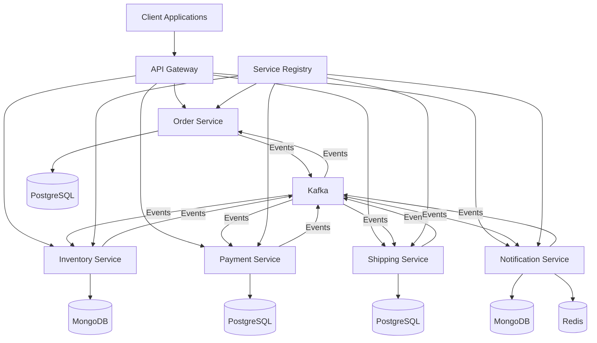

# E-commerce Microservices with Saga Pattern


A professional implementation of an e-commerce system using microservice architecture with Saga pattern for distributed transaction management.

*Created by: hacisimsek*  
*Last Updated: 2025-05-26 18:40:03*

## Table of Contents

- [Overview](#overview)
- [Architecture](#architecture)
- [Microservices](#microservices)
- [Technologies](#technologies)
- [Saga Pattern Implementation](#saga-pattern-implementation)
- [Project Structure](#project-structure)
- [Setup Instructions](#setup-instructions)
- [API Documentation](#api-documentation)
- [Testing](#testing)
- [Contributing](#contributing)

## Overview

This project implements a robust e-commerce system using a microservices architecture. The system handles order processing, inventory management, payment processing, shipping logistics, and customer notifications while maintaining data consistency across distributed services through the Saga pattern.

## Architecture

The architecture follows the microservices pattern with the following components:



## Microservices

1. **Order Service**:
    - Manages order creation and lifecycle
    - Initiates the order saga process
    - Tracks order status throughout the saga

2. **Inventory Service**:
    - Manages product inventory
    - Handles inventory reservation during order processing
    - Provides inventory availability checks

3. **Payment Service**:
    - Processes customer payments
    - Manages payment refunds for compensation transactions
    - Tracks payment status

4. **Shipping Service**:
    - Creates shipments for orders
    - Generates tracking information
    - Manages delivery status

5. **Notification Service**:
    - Sends notifications to customers
    - Supports multiple notification channels
    - Tracks notification delivery status

6. **Infrastructure Services**:
    - **Service Registry**: Service discovery with Eureka
    - **API Gateway**: Routing and cross-cutting concerns

## Technologies

- **Java 17**: Core programming language
- **Spring Boot 3.2.12**: Application framework
- **Spring Cloud**: Microservices toolkit
- **Apache Kafka**: Event streaming platform for service communication
- **Databases**:
    - **PostgreSQL**: For Order, Payment, and Shipping services
    - **MongoDB**: For Inventory and Notification services
    - **Redis**: For caching and temporary data storage
- **Docker & Docker Compose**: Containerization and orchestration
- **Maven**: Build and dependency management

## Saga Pattern Implementation

This project implements the Saga pattern using a choreography-based approach:

### Order Processing Flow:

1. **Order Creation**:
    - Customer places an order
    - Order service creates an order with PENDING status
    - Order service publishes OrderCreatedEvent

2. **Inventory Reservation**:
    - Inventory service consumes OrderCreatedEvent
    - Checks product availability
    - Reserves inventory if available
    - Publishes InventoryReservedEvent or InventoryReservationFailedEvent

3. **Payment Processing**:
    - Payment service consumes InventoryReservedEvent
    - Processes payment
    - Publishes PaymentProcessedEvent or PaymentFailedEvent

4. **Shipping Creation**:
    - Shipping service consumes PaymentProcessedEvent
    - Creates shipping record
    - Publishes ShipmentProcessedEvent or ShipmentFailedEvent

5. **Order Completion**:
    - Order service updates order status to COMPLETED

### Compensation Transactions:

If any step fails, the system executes compensation transactions to maintain consistency:

- **Payment Failure**: Inventory service releases reserved inventory
- **Shipping Failure**: Payment service refunds payment, Inventory service releases inventory
- **Notification Service**: Informs the customer about transaction status (success/failure)

## Project Structure

```
ecommerce-microservices/
├── pom.xml                          # Parent POM
├── common-library/                  # Shared code between services
├── service-registry/                # Eureka Service Discovery
├── api-gateway/                     # Spring Cloud Gateway
├── order-service/                   # Order management
├── inventory-service/               # Inventory management
├── payment-service/                 # Payment processing
├── notification-service/            # Notification handling
├── shipping-service/                # Shipping management
└── docker-compose.yml               # Docker composition for all services
```

## Setup Instructions

### Prerequisites

- Java 17
- Maven 3.8+
- Docker and Docker Compose
- Kafka and ZooKeeper
- PostgreSQL, MongoDB, Redis

### Running the Application

1. **Clone the repository**:
```bash
git clone https://github.com/hacisimsek/ecommerce-microservices.git
cd ecommerce-microservices
```

2. **Build the project**:
```bash
mvn clean package -DskipTests
```

3. **Start the infrastructure with Docker Compose**:
```bash
docker-compose up -d
```

4. **Check service health**:
```bash
# Access Eureka dashboard
http://localhost:8761

# Check API Gateway
http://localhost:8080/actuator/health
```

## API Documentation

### Order Service

#### Create an Order
```
POST /api/orders
Content-Type: application/json

{
  "customerId": "3fa85f64-5717-4562-b3fc-2c963f66afa6",
  "items": [
    {
      "productId": "3fa85f64-5717-4562-b3fc-2c963f66afa6",
      "productName": "Smartphone",
      "quantity": 1,
      "price": 799.99
    }
  ]
}
```

#### Get Order by ID
```
GET /api/orders/{orderId}
```

#### Get All Customer Orders
```
GET /api/orders/customer/{customerId}
```

### Inventory Service

#### Create Inventory Item
```
POST /api/inventory
Content-Type: application/json

{
  "name": "Smartphone",
  "description": "Latest smartphone model",
  "quantity": 100
}
```

#### Check Product Availability
```
GET /api/inventory/check?productId={productId}&quantity={quantity}
```

### Payment Service

#### Get Payment by Order ID
```
GET /api/payments/order/{orderId}
```

### Shipping Service

#### Get Shipment by Order ID
```
GET /api/shipping/order/{orderId}
```

### Notification Service

#### Get Customer Notifications
```
GET /api/notifications/customer/{customerId}
```

## Testing

### Unit Tests
```bash
mvn test
```

### Integration Tests
```bash
mvn verify -P integration-test
```

### End-to-End Testing
Use Postman or curl to test the full order processing flow:

1. Create an inventory item
2. Create an order
3. Check order status
4. Verify payment creation
5. Verify shipment creation
6. Verify notifications

## Contributing

1. Fork the repository
2. Create your feature branch (`git checkout -b feature/amazing-feature`)
3. Commit your changes (`git commit -m 'Add some amazing feature'`)
4. Push to the branch (`git push origin feature/amazing-feature`)
5. Create a new Pull Request

---

*© 2025 hacisimsek. All rights reserved.*
